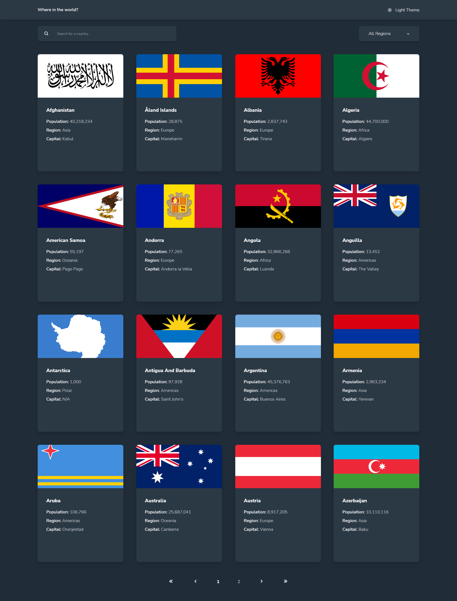
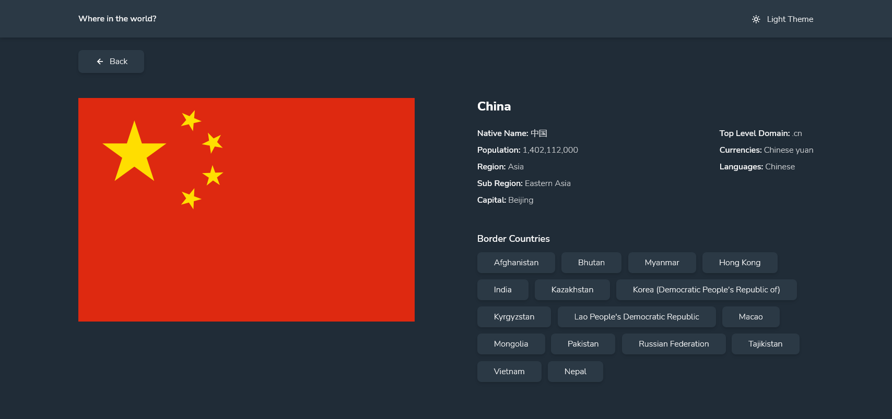

# Frontend Mentor - REST Countries API with color theme switcher solution

This is a solution to the [REST Countries API with color theme switcher challenge on Frontend Mentor](https://www.frontendmentor.io/challenges/rest-countries-api-with-color-theme-switcher-5cacc469fec04111f7b848ca). Frontend Mentor challenges help you improve your coding skills by building realistic projects.

## Table of contents

- [Frontend Mentor - REST Countries API with color theme switcher solution](#frontend-mentor---rest-countries-api-with-color-theme-switcher-solution)
	- [Table of contents](#table-of-contents)
	- [Overview](#overview)
		- [The challenge](#the-challenge)
		- [Screenshot](#screenshot)
		- [Links](#links)
	- [My process](#my-process)
		- [Built with](#built-with)
		- [What I learned](#what-i-learned)
			- [Color Theme](#color-theme)
			- [List Filtering](#list-filtering)
			- [Pagination](#pagination)
		- [Useful resources](#useful-resources)
	- [Author](#author)
	- [Acknowledgments](#acknowledgments)

## Overview

### The challenge

Users should be able to:

- See all countries from the API on the homepage
- Search for a country using an `input` field
- Filter countries by region
- Click on a country to see more detailed information on a separate page
- Click through to the border countries on the detail page
- Toggle the color scheme between light and dark mode _(optional)_

### Screenshot




### Links

- Solution URL: [Right here!](https://www.frontendmentor.io/solutions/responsive-paginated-countries-api-app-built-with-ssr-and-prefetching-r1y6lkfN9)
- Live Site URL: [Deployed on Vercel](https://rest-countries-api-app-sigma.vercel.app/)

## My process

### Built with

- Responsive Design
- Semantic HTML5 markup
- Svelte + Sveltekit
- TypeScript
- WindiCSS
- Vitest
- Vite

### What I learned

#### Color Theme

I had to come up with a color theme implementation. I solved it by creating a custom Svelte store.

```ts
export function useDarkTheme(initialValue: ColorTheme, localStorageKey: string) {
	const { subscribe, set, update } = writable(initialValue, (set) => {
		if (browser) {
			const theme = localStorage.getItem(localStorageKey);
			switch (theme) {
				case 'DARK': {
					set('DARK');
					setDarkTheme();
					break;
				}
				case 'LIGHT': {
					set('LIGHT');
					setLightTheme();
					break;
				}
				default: {
					const theme = preffersDarkTheme() ? 'DARK' : 'LIGHT';
					set(theme);
					theme === 'DARK' ? setDarkTheme() : setLightTheme();
					localStorage.setItem(localStorageKey, theme);
				}
			}
		}
	});
	return {
		subscribe,
		set(this: void, value: ColorTheme) {
			set(value);
			value === 'DARK' ? setDarkTheme() : setLightTheme();
			localStorage.setItem(localStorageKey, value);
		},
		toggle(this: void) {
			update((theme) => {
				const newTheme = theme === 'DARK' ? 'LIGHT' : 'DARK';
				newTheme === 'DARK' ? setDarkTheme() : setLightTheme();
				localStorage.setItem(localStorageKey, newTheme);
				return newTheme;
			});
		}
	};
}
```

Then I initialise it once in a seperate file so that **it is accessible everywhere in the app!**

```html
<script>
	import { theme } from '../stores';

	$: themeIcon = $theme === 'DARK' ? 'bx-sun' : 'bx-moon';
	$: themeText = $theme === 'DARK' ? 'Light' : 'Dark';
</script>

<button
	class="flex items-center gap-3 | rounded-sm focus-ring focus:(dark:ring-offset-blue-700 ring-offset-gray-98 ring-offset-6)"
	aria-label="toggle color theme"
	aria-describedby="theme-toggler-label"
	on:click="{theme.toggle}"
>
	<span class="sr-only" id="theme-toggler-label">
		Change color theme from dark to light or light to dark
	</span>
	<i class="bx {themeIcon} text-lg" />
	<span> {themeText} Theme </span>
</button>
```

#### List Filtering

Filtering the countries was **troublesome** since I wanted to do optimisations and I had faced this problem only once when I built a movies app using React and Redux (yuck!) and well... it kind of worked. So I didn't know how I would do this in Svelte but at the end of the day I decided that maybe I should just get the work done and don't worry about performance too much since the pagination I implemented improved it a ton! since Svelte has only to render **16** countries at once and the images are **lazy loaded!**

```ts
export function filterByName<T extends { name: string }>(countries: T[], name: string) {
	return countries.filter((country) => country.name.includes(name));
}

export function filterByNameAndRegion<T extends { name: string; region: string }>(
	countries: T[],
	name: string,
	region: string
) {
	return countries.filter((country) => country.region === region && country.name.includes(name));
}

export function filterByRegion<T extends { region: string }>(countries: T[], region: string) {
	return countries.filter((country) => country.region === region);
}

$: {
	if (lowerName || region) {
		if (lowerName && region)
			filteredCountries = filterByNameAndRegion(countries, lowerName, region);
		else if (lowerName) filteredCountries = filterByName(countries, lowerName);
		else if (region) filteredCountries = filterByRegion(countries, region);
	} else filteredCountries = countries;
}

$: paginated = paginate({ items: filteredCountries, currentPage, pageSize: 16 });
```

Then I just render the paginated countries.

```svelte
{#each paginated as country, index (index)}
	<li>
		<Country {country} />
	</li>
{/each}
```

#### Pagination

Yep. **I had to come up with a solution for the pagination**. I initilly tried to use a library for it but it was old and didn't have TypeScript support nor meet my styling spectations... so I had to go the hard way and get it done all on my own. Although I took a function from that library and improved it a little bit I guess. I used **Vitest** to make sure it worked properly, at least in a certain number of scenarios. I know it may need more testing and improvements but it works well enough and I am content.

```ts
export function getPages(configuration: {
	currentPage: number;
	totalPages: number;
	limit?: number;
}) {
	let { currentPage, totalPages, limit } = configuration;

	if (Math.ceil(totalPages) <= 0 || currentPage <= 0) return [1];

	let start = 1;
	let lastPage = Math.ceil(totalPages) + 1; // + 1 -> range max is exclusive

	currentPage = currentPage > totalPages ? Math.ceil(totalPages) : currentPage;

	if (limit === 0) return [currentPage];
	if (typeof limit === 'number' && limit > 0) {
		let limitLastPage = currentPage + limit + 1;
		lastPage = limitLastPage > lastPage ? lastPage : limitLastPage;
		let limitStart = currentPage - limit;
		start = limitStart > 0 ? limitStart : 1;
	}

	if (currentPage === lastPage - 1) {
		if (currentPage === 1) return range(start, lastPage);
		return [...range(start, currentPage), currentPage];
	}

	if (currentPage === 1) {
		return [currentPage, ...range(currentPage + 1, lastPage)];
	}

	return [...range(start, currentPage), currentPage, ...range(currentPage + 1, lastPage)];
}

export function paginate<T>(configuration: { items: T[]; currentPage: number; pageSize: number }) {
	const { items, currentPage, pageSize } = configuration;
	const totalPages = Math.ceil(items.length / pageSize);
	if (currentPage >= totalPages) return items.slice((totalPages - 1) * pageSize);
	return items.slice((currentPage - 1) * pageSize, (currentPage - 1) * pageSize + pageSize);
}

export function range(min: number, max: number) {
	if (min === max) return [min];
	return [...Array(Math.floor(max - min)).keys()].map((i) => i + min);
}
```

Import and paginate the filtered pages and pass it!

```ts
import { paginate } from '$lib/paginate';

$: paginated = paginate({ items: filteredCountries, currentPage, pageSize: 16 });
```

```svelte
<Pagination bind:currentPage items={filteredCountries} pageSize={16} />
```

I made the pagination component renderless so that I can decide what I render. It only exposes core functions and variables.

```ts
<script lang="ts">
	import { getPages } from './';

	export let items: unknown[] = [];
	export let currentPage = 1;
	export let pageSize = 15;
	export let limit: number | undefined = undefined;

	$: totalPages = Math.ceil(items.length / pageSize);
	$: if (currentPage > totalPages && totalPages > 0) currentPage = totalPages;
	$: pages = getPages({ currentPage, totalPages, limit });

	const go = {
		first() {
			currentPage = 1;
		},
		last() {
			if (currentPage > 0) currentPage = totalPages;
		},
		next() {
			if (currentPage < totalPages) currentPage++;
		},
		previous() {
			if (currentPage > 1) currentPage--;
		},
		to(page: number) {
			if (page > totalPages || page < 0) return;
			currentPage = page;
		}
	};
</script>

{#if totalPages > 1}
	<slot {go} {pages} {totalPages} />
{/if}
```

### Useful resources

- [Sveltekit Docs](https://kit.svelte.dev/docs/introduction) - Always visit Sveltekit docs when in doubt.

## Author

- Frontend Mentor - [@Shawn Lee](https://www.frontendmentor.io/profile/OGShawnLee)

## Acknowledgments

- [Svelte Pagination](https://www.npmjs.com/package/svelte-paginate) - I took inspiration from here.
